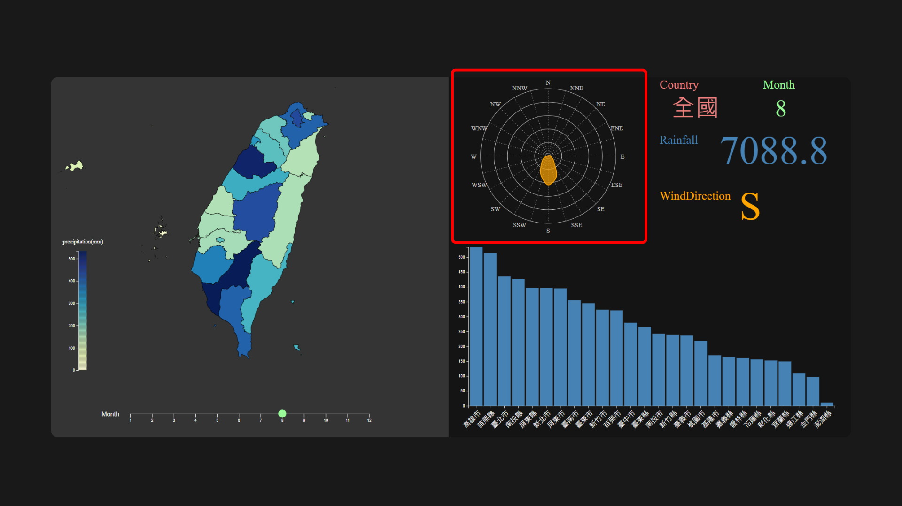

# The Patterns of Wind Direction and Precipitation in Taiwan

This project is an interactive visualization for analyzing precipitation and wind direction across cities in Taiwan.

## Features

- **Taiwan Map (Left):**
  - Displays a map of Taiwan, with each city/county colored according to its precipitation for the selected month.
  - Clicking a city/county highlights it and updates the wind and rainfall data for that region.
  - Users can select a month using the control below the map.

- **Wind Direction Radar Chart (Top Right):**
  - Shows the distribution of wind directions for the selected city/county and month.
  - The radar chart updates dynamically based on user selections.

- **Information Panel (Top Right):**
  - Displays details for the selected city/county and month, including:
    - Name of the region
    - Month
    - Total rainfall
    - Dominant wind direction

- **Monthly Rainfall Bar Chart (Bottom Right):**
  - Visualizes the rainfall amounts for all cities in the selected month.
  - Automatically sorted from highest to lowest.

## Usage scenarios & tasks

1. Compare regional differences in rainfall
   * Observe the map and bar chart to compare rainfall across regions.

1. Observe all the patterns change by time
   * Use the month selector below the map to switch between months.

1. Observe all the patterns of specific city:
   * Click on a city/county on the map to view its specific rainfall and wind direction data.
   * The information panel will also update the details for the selected city and month.

1. Compare the relation between rainfall and wind direction
   * Observe the radar chart and bar chart to analyze the relationship between rainfall and wind direction.

## Dataset
- Precipitation and wind direction data are loaded from CSV and JSON files in the `dataset` folder.
  - Calculate the total rainfall in each month from daily data.
  - Statistic wind direction distribution in each month from daily data.
- Geographic data for Taiwan is loaded from `taiwan.json`.

## Technologies
- [D3.js](https://d3js.org/) for interactive data visualization
- JavaScript, HTML, and SVG

## Demo
A demo video is available in `demo.mp4`.